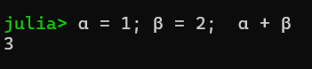

```{r}
library(qrcode)
primary_color <- "#090909"
secondary_color <- "#F2F6F5"
link = "https://github.com/brandmaier/lip2026-julia-workshop"
generate_svg(qr_code(link), here::here("img/", "qr_talk.svg"), foreground = secondary_color, background = primary_color, show = FALSE)
```

## Julia

:::: columns

::: {.column width="50%"}


::: {.column width="50%"}


## About Julia

**Julia** is a relatively young (2012) programming language designed to be particularly effective for scientific workflows - the developers specifically call out Fortran and MATLAB as predecessors in this area.

Compared to these, Julia has much of the dynamic and interactive expressiveness of languages such as *Python*, whilst leveraging just-in-time compilation and specialization to allow performance approaching (and sometimes better than) high-performance compiled languages such as *C*, *C++*, *Modern Fortran* and *Rust*.

Sources: <https://juliahep.github.io/JuliaHEP-2023/intro.html> , <https://physi.uni-heidelberg.de/~reygers/lectures/2024/julia/julia-01-intro.slides.html>

## Why Julia

Solves the dual-language problem. From ThinkJulia.jl:

*Julia is a unique programming language because it solves the so-called two languages problem. No other programming language is needed to write high-performance code. This does not mean it happens automatically. It is the responsibility of the programmer to optimize the code that forms a bottleneck but this can done in Julia itself.*

-   Open source and free: The whole language and all packages!

-   Easy to get started

-   Many third party libraries

    Source: <https://physi.uni-heidelberg.de/~reygers/lectures/2024/julia/julia-01-intro.slides.html>

## Some Nice Features

-   Easy to write yet fast

-   Full unicode support, e.g., this is valid code: 

-   excellent package manager with powerful libraries

-   Juptyer notebooks (for dynamic documents and reproducible research)

-   A variety of modern programming paradigms that makes Julia code highly efficient, elegant, and extensible (e.g., multiple dispatch, dynamic typing, functional chaining of methods (like pipes in R), etc..)

## Where to start?

Some pointers to practical resources:

-   The Julia Cheat Sheet <https://cheatsheets.quantecon.org/julia-cheatsheet.html>

-   The "official" Cheat Sheet: <https://cheatsheet.juliadocs.org/>

-   Exercises: 100 Julia exercises with solutions: <https://pythonjulia.blogspot.com/2022/03/100-julia-exercises-with-solutions.html>

-   A set of introductory slides: <https://physi.uni-heidelberg.de/~reygers/lectures/2024/julia/>

# Look and Feel

Goal of the first part: Get the look&feel of Julia

## Basic Syntax

Should look familiar to R and python users

```{julia}
a = 1.0
a + 10
α = 1 # type \alpha and hit TAB
name = "Julia"

a += 2 # update operator
```

(here, we already see dynamic typecasting in action)

## Types

```{julia}
a::Int = 1
b::UInt = 2
c::UInt16 = 3
```

```{julia}
# Should fail:
a = a + 0.1
b = -1
```

## Enumerations

Enumerations are like special types of your own:

```{julia}
@enum Fruit apple=1 banana=2 orange=3

using Random

f = Fruit(rand(1:3)) 

f == apple
f == banana 
```

## Loops

```{julia}
for number in 1:4
    println("I am at number $number")
end
```

or fancy using (\in with TAB):

```{julia}
for number ∈ 1:4
    println("I am at number $number")
end
```

## Zip

Iterating over multiple things:

```{julia}
list_a = 1:4
list_b = ["John", "Paul", "George", "Ringo"]

for (a, b) ∈ zip(list_a, list_b)
  println("$b is Beatle #$a")
end
```

## Functions

```{julia}

times2(x) = 2 * x

times2(1)
times2("hallo") # should fail
```

Now we use typed arguments to define variants of our functions depending on the input types (multiple dispatch):

```{julia}
times2(x::Number) = x * x
times2(x::String) = x * x

times2("hallo")
times2(1.0+2im)
```

## Vectors

```{julia}
x = [1, 2, 3, 4]
x[1]
x[end]

y = 1:10
y
collect(y)
```

## Installing Packages

For more functionality, install packages from the registry:

```{julia}
using Pkg
Pkg.add(["StructuralEquationModels", "CSV", "Distributions", "DataFrames", "StableRNGs"])
```

## Data Frames

```{julia}
using DataFrames

df = DataFrame( age = 1:10,
       happiness = ((20 .* randn(10)).+50) )

df.age
df[:, 1]

print(df)
```

## In-place Modification

Sort an array (and return the sorted version):

```{julia}

sort(df)

```

Sort an array and replace the original with the sorted version (exclamation mark indicates modification):

```{julia}

sort!(df)

```

## Loading Data

```{julia}
using CSV, DataFrames
data = CSV.read("my_datafile.tsv", DataFrames.DataFrame;
# ensures column names are valid Julia symbols
normalizenames = true,
# expect comma-separated values
delim = '\t',
# handle missing data
missingstring = ["", "NA", "NaN"],
# ignore duplicate column delimiters
ignorerepeated = true
)
```

## Symbols

-   Symbols in Julia start with a colon
-   They are immutable labels
-   Column names are symbols

```{julia}
rename!(df, :happiness => :life_satisfaction)
```

## Plots

```{julia}
using Plots
plot(df.age, df.life_satisfaction)
```

Add to the plot using the modification operator
```{julia}
plot!(df.age, df.age)
```

## Exercise

1.  Load the workshop data file ("exercise_sheet1.csv") using the CSV package
2.  Inspect the loaded data
3.  Compute the mean of the first variable (using `mean()` from package Statistics)
4.  Bonus: How to compute the mean across all columns?
5. Plot a scatter plot of the first two columns

## Solution

```{julia}

using CSV, DataFrames
data = CSV.read("exercise_sheet1.csv", DataFrames.DataFrame;
# ensures column names are valid Julia symbols
normalizenames = true,
# expect comma-separated values
delim = ',',
# handle missing data
missingstring = ["", "NA", "NaN"],
# ignore duplicate column delimiters
ignorerepeated = true
)
```

## Solution Cont'd

```{julia}
print(data)
mean(data.age)
mean.(data) #use broadcast operator
plot(data[:,1], data[:,2])
```

# Move on to PART II of the workshop
