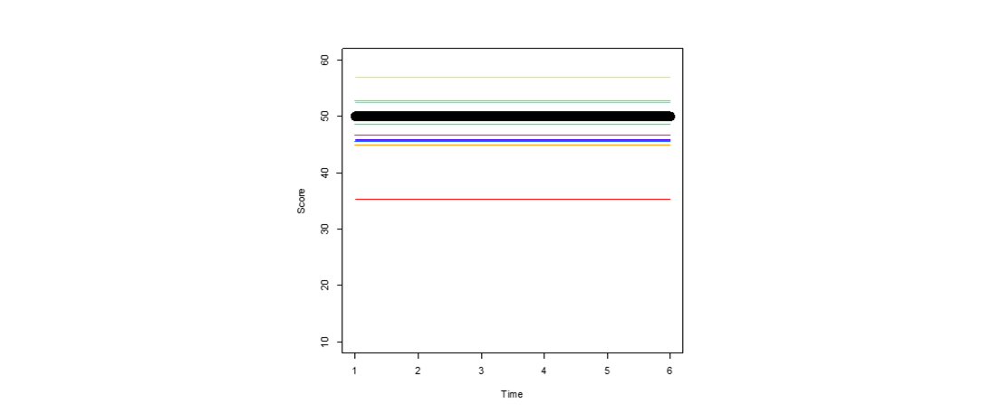

```{r setup}
library(JuliaCall)
julia_setup(JULIA_HOME = 'C:\\Users\\andreas.brandmaier\\AppData\\Local\\Programs\\Julia-1.11.7\\bin')
```

## Quarto

Goal of the second part: Get familiar with "StructuralEquationModel.jl” (Ernst, Stukalov, Brandmaier, & Peikert, Submitted)

## Linear Latent Growth Curve Model


::::: columns
::: {.column width="50%"}
Step-By-Step


:::

::: {.column width="50%"}

:::
:::::

## Load the package

This may take some time on first loading:

```{julia eval=TRUE, echo=TRUE}
using StructuralEquationModels
```

## Define variables

Define symbols for all observed and all latent variables:

```{julia eval=TRUE, echo=TRUE}
obs = [:y1, :y2, :y3, :y4, :y5]
lat = [:i, :s]
```

## Define a Model

Regression (with free parameter):

```{julia eval=FALSE}
{a → b #type \rightarrow or \leftarrow}
```

Covariance (with free parameter)

```         
a ↔ b #type \\leftrightarrow
```

Variance

```         
a ↔ a
```

## One-to-one and many-to-many mappings

```         
[a b] → [c d]
```

evaluates to `a → c, b → d`.

```         
[a b] ⇒ [c d]
```

is equivalent to saying `a → c, a → d, b → c, b → d`.

## Define a graph

```{julia empty, eval=FALSE}
graph = @StenoGraph begin

   ...
   
end
```

## Define a graph

```{julia eval=TRUE, echo=TRUE}


graph = @StenoGraph begin
    # Intercept factor: all loadings fixed to 1
    i → fixed(1)*y4 + fixed(1)*y7 + fixed(1)*y8 + fixed(1)*y10

    # Slope factor: linear time scores
    s → fixed(0)*y4 + fixed(1)*y7 + fixed(2)*y8 + fixed(3)*y10

    # Residual variances (free) and latent (co)variances (free)
    _(obs) ↔ _(obs)     # variances for observed variables
    _(lat) ⇔ _(lat)     # variances + covariance for latent factors

    # Latent means (estimate μ_i and μ_s); 
    # observed means fixed to 0 by omission
    Symbol(1) → i + s
end
```

## Parameter Table

```{julia}
partable = ParameterTable(
    graph,
    latent_vars   = lat,
    observed_vars = obs
)
```

## Model

```{julia modelsem, eval=FALSE}
model = Sem(
    specification = partable,
    data          = data
)
```

## Fit

```{julia fitmodel, eval=FALSE}
fitted = fit(model)
```

## Obtaining Fit Measures

```{julia fitmeasures, eval=FALSE}
fit_measures(fitted)
```

## Getting Parameters

```{julia updatepar, eval=FALSE}
update_estimate!(partable, fitted)
details(partable)
```

## Comparing two models

```{julia lrt, eval=FALSE}

Δdev = minus2ll(fitted_h0) - minus2ll(fitted)
Δdf  = dof(fitted_h0) - dof(fitted)

using Distributions
p = 1 - cdf(Chisq(Δdf), Δdev)  # p-value for the LRT
```

## Exercise

This exercise sheet is targeted at social scientists who are interested in modeling change over time in the Julia programming language using the package StructuralEquationModels.jl.

Download the exercise sheet: <https://github.com/brandmaier/lip2026-julia-workshop/blob/main/exercises/exercise_sheet1.pdf>

Download the data file: <https://github.com/brandmaier/lip2026-julia-workshop/blob/main/exercises/exercise_sheet1.csv>

## Goals

Your tasks:

-   Set up and fit a linear latent growth curve model (LGCM) in Julia using StructuralEquationModels.jl.
-   Modify a model to accommodate unequal time intervals.
-   Diagnose and fix an error in the model specification.
-   Compare nested models via likelihood ratio ($\chi^2$) tests.
-   Interpret key growth parameters (means, variances, covariances).
-   Empirically test a model including a retest effect
