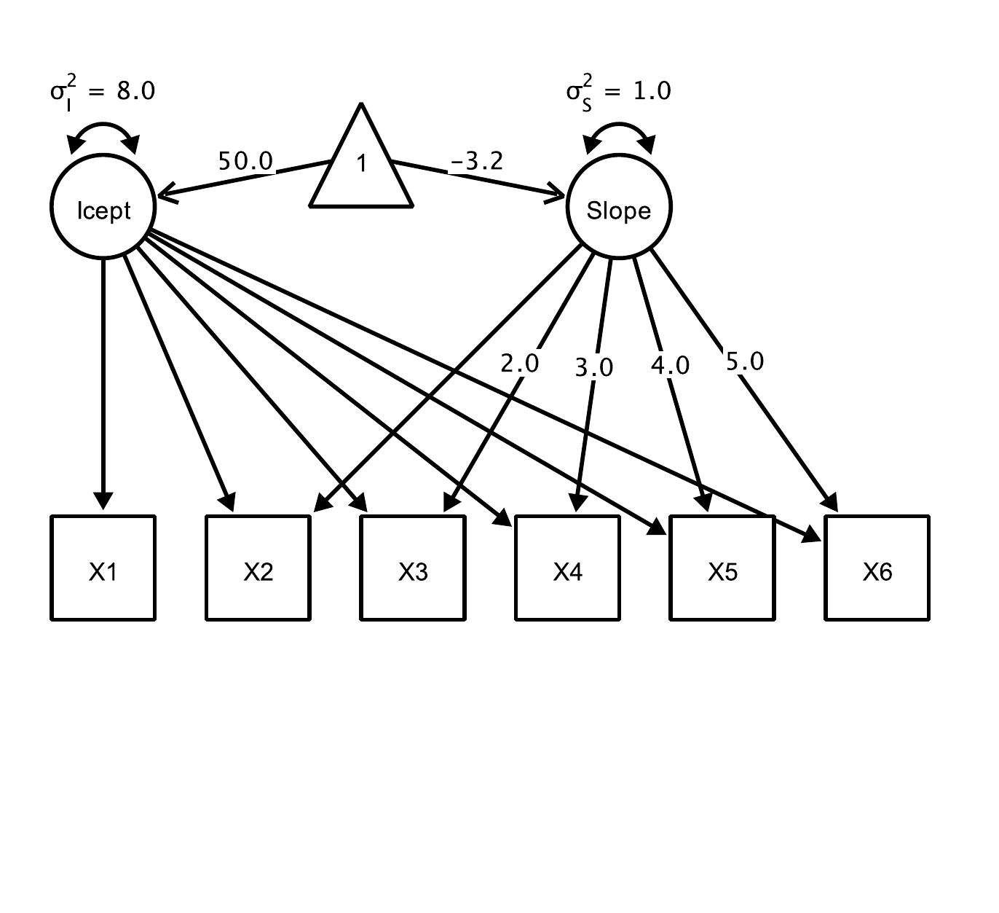
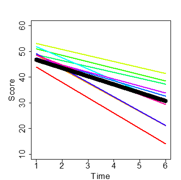
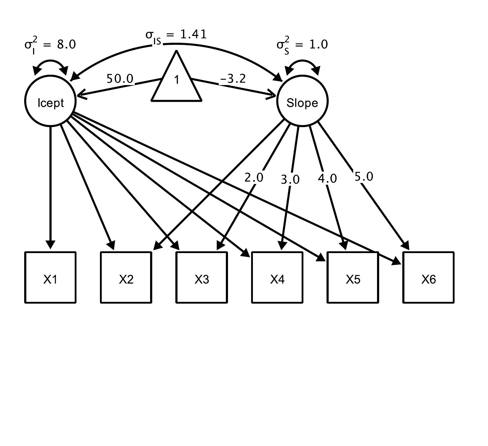
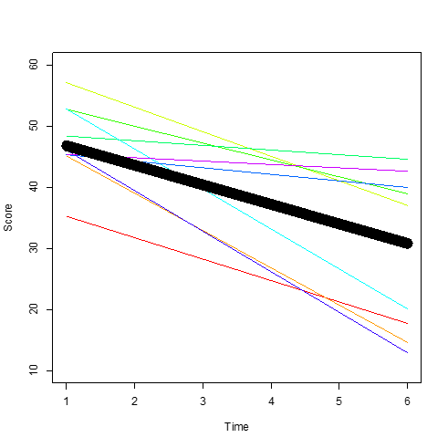
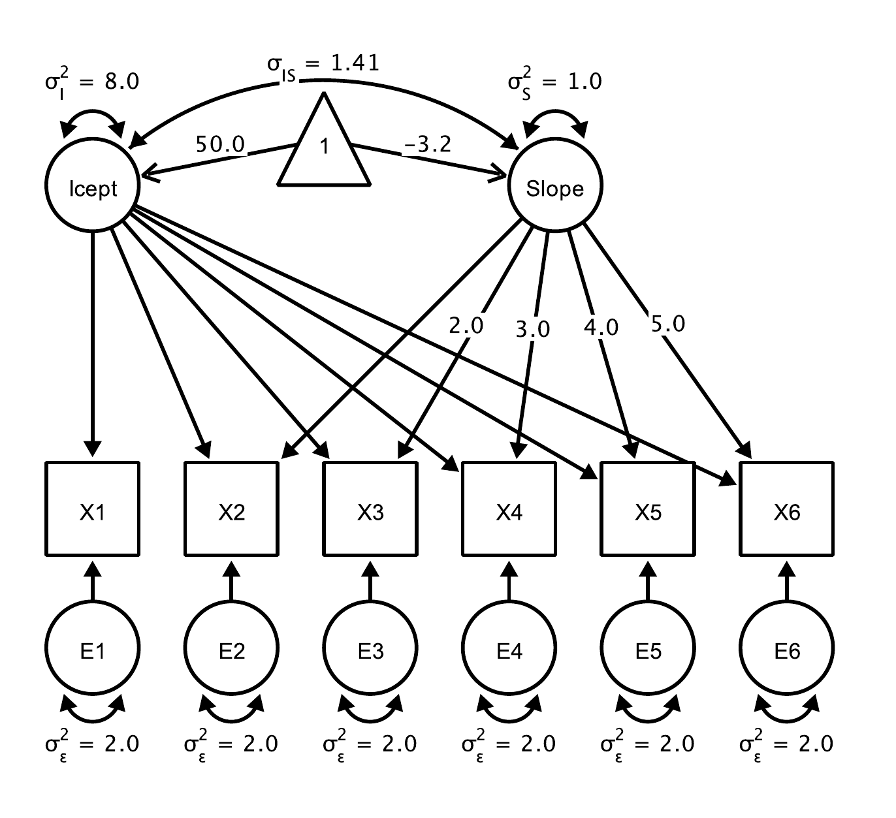
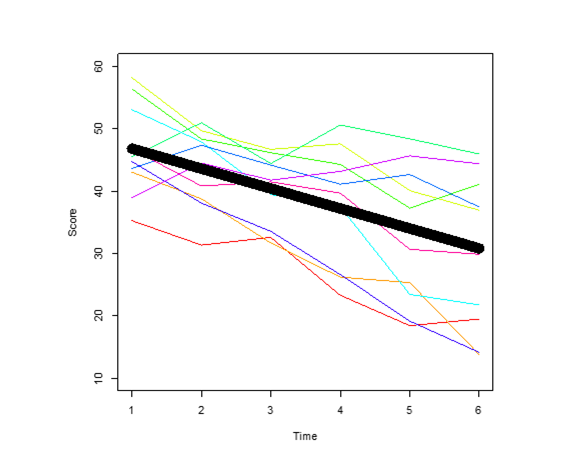
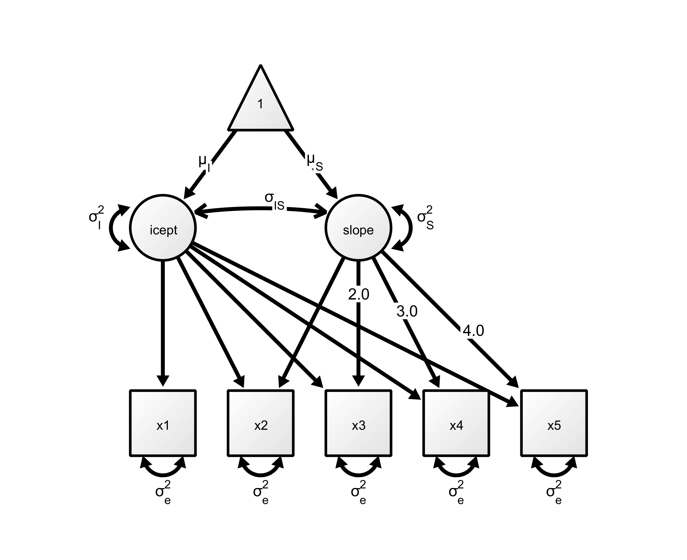
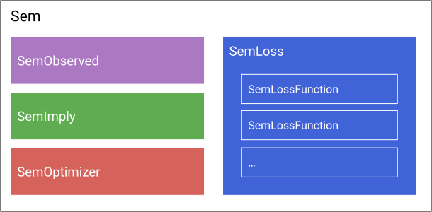

```{r setup}
# I am sorry - this is a terrible solution :( 
if (Sys.info()[["user"]]=="andreas.brandmaier") {
 library(JuliaCall)
 julia_setup(JULIA_HOME = 'C:\\Users\\andreas.brandmaier\\AppData\\Local\\Programs\\Julia-1.11.7\\bin')
}
```

```{julia eval=TRUE, echo=FALSE}
#| results: 'hide'

using CSV, DataFrames
data = CSV.read("data/lgcm.csv", DataFrames.DataFrame;
# ensures column names are valid Julia symbols
normalizenames = true,
# expect comma-separated values
delim = ',',
# handle missing data
missingstring = ["", "NA", "NaN"],
# ignore duplicate column delimiters
ignorerepeated = true
);
```

## Goal

::: callout
Get familiar with "StructuralEquationModel.jl” (Ernst, Stukalov, Brandmaier, & Peikert, Submitted)
:::

## Linear Latent Growth Curve Model

-   Linear latent growth curve models assume linear change over time
-   Our goal is to model individual differences in both level and change
-   Level and change can be associated
-   Residual errors in the measurement model should capture deviations from this linearity and measurement error
-   Change can be associated with antecedents, consequences, or changes in other domains

## Step-By-Step - Part I

::::: columns
::: {.column width="50%"}

:::

::: {.column width="50%"}

:::
:::::

## Step-By-Step - Part II

::::: columns
::: {.column width="50%"}

:::

::: {.column width="50%"}

:::
:::::

## Step-By-Step - Part III

::::: columns
::: {.column width="50%"}

:::

::: {.column width="50%"}

:::
:::::

## Step-By-Step - Part IV

::::: columns
::: {.column width="50%"}

:::

::: {.column width="50%"}

:::
:::::

## Parameter Estimates {.smaller}

::::: columns
::: {.column width="50%"}

:::

::: {.column width="50%"}
-   Intercept mean: Average level at baseline
-   Intercept variance: Individual differences at baseline
-   Slope mean: Average change per „one unit“ of time
-   Slope variance: Individual differences in change
-   Intercept-Slope covariance: Associations of differences in level and change (often rescaled as correlation)
-   Residual error variance: Measurement error + misspecification
:::
:::::

# StructuralEquationModels.jl

## Workflow

-   Load package
-   Load data (see Part I)
-   Define all variables
-   Specify the model as graph with relations between variables
-   Translate the graph to a parameter table
-   Create a model object from the parameter table and the data
-   Fit the model
-   Inspect the model

## Load the package

If you have not installed the package yet:

```{julia install, eval=FALSE, echo=TRUE}
using Pkg
Pkg.add("StructuralEquationModels")
```

This may take some time on first loading:

```{julia loadpack, eval=TRUE, echo=TRUE}
using StructuralEquationModels
```

## Define variables

Define symbols (remember that symbols start with a colon) for all observed and all latent variables:

```{julia eval=TRUE, echo=TRUE}
# five observed time points
obs = [:y1, :y2, :y3, :y4, :y5]

# intercept and slope (latent)
lat = [:i, :s]
```

## Define a Model

Regression (with free parameter):

```{julia eval=FALSE, echo=TRUE}
a → b #type \rightarrow or \leftarrow}
```

Covariance (with free parameter)

```{julia eval=FALSE, echo=TRUE}
a ↔ b #type \leftrightarrow
```

Variance

```{julia eval=FALSE, echo=TRUE}
a ↔ a
```

Means (using a constant one):

```{julia eval=FALSE, echo=TRUE}
Symbol(1) → [a b c]
Symbol(1) → a + b # or lavaan style

```

## Fix parameters at values

Using `fixed(...)` with a given value

For example, this fixes the path from `x` to `y` at a value of one:

```{julia eval=FALSE, echo=TRUE}
x → fixed(1)*y 
```

Or, this fixes the covariance of `a` and `b` to zero:

```{julia eval=FALSE, echo=TRUE}
a ↔ fixed(0)*b
```

## One-to-one and many-to-many mappings

```{julia eval=FALSE, echo=TRUE}
[a b] → [c d]
```

evaluates to `a → c, b → d`.

```{julia eval=FALSE, echo=TRUE}
[a b] ⇒ [c d] # type \\Rightarrow (uppercase 'R')
```

is equivalent to saying `a → c, a → d, b → c, b → d`.

```{julia eval=FALSE, echo=TRUE}
[a b] ⇔ [a b] # type \\Rightarrow (uppercase 'R')
```

is equivalent to saying `a  ↔ a, a  ↔  b, b  ↔  b (, b  ↔ a)`.

## Escaping

If you want to refer to a variable outside the Stenograph, you need to escape its name:

```{julia eval=FALSE, echo=TRUE}
# not escaped, refers to symbol :obs
obs ⇔ obs

# escaped, refers to a variable with name obs, which has symbol(s) as content (here: y1, y2, ...)
_(obs) ⇔  _(obs)
```

## Define a graph

Graphs are defined using a Stenograph macro

```{julia empty, eval=FALSE, echo=TRUE}
graph = @StenoGraph begin

   ...
   
end
```

## LGCM Graph (Onyx)



## Define a graph

```{julia defgraph, eval=TRUE, echo=TRUE}
graph = @StenoGraph begin
# Intercept factor: all loadings fixed to 1
i → fixed(1)*y1 + fixed(1)*y2 + fixed(1)*y3 + fixed(1)*y4

# Slope factor: linear time scores
s → fixed(0)*y1 + fixed(1)*y2 + fixed(2)*y3 + fixed(3)*y4

# Residual variances (free) and latent (co)variances (free)
_(obs) ↔ _(obs) # variances for observed variables
_(lat) ⇔ _(lat) # variances + covariance for latent factors

# Latent means (estimate μ_i and μ_s);
# observed means fixed to 0 by omission
Symbol(1) → i + s
end
```

## Constraints

The specification above assumes heteroscedastic residual error variances. What about homoscedastic residual error variances?

-\> Constraints

```{julia eval=FALSE, echo=TRUE}
label(:e)*y1 ↔ y1
```

## In our model

```{julia eval=FALSE, echo=TRUE}
label(:e)*y1 ↔ y1
label(:e)*y2 ↔ y2
label(:e)*y3 ↔ y3
label(:e)*y4 ↔ y4
```

Or, use broadcasting with element-wise multiplication of two arrays:

```{julia eval=FALSE, echo=TRUE}
_(obs) ↔ [label(:e)].*_(obs)
```

## Parameter Table

```{julia eval=TRUE, echo=TRUE}

partable = ParameterTable(
    graph,
    latent_vars   = lat,
    observed_vars = obs
)
```

## Model

```{julia eval=TRUE, echo=TRUE}

model = Sem(
    specification = partable,
    data          = data
)
```

## Model



## Fit

```{julia eval=TRUE, echo=TRUE}

fitted = fit(model)
```

## Obtaining Fit Measures

```{julia eval=TRUE, echo=TRUE}

fit_measures(fitted)
```

## Getting Parameters

```{julia eval=TRUE, echo=TRUE}

update_estimate!(partable, fitted)
```

## Getting Parameters (Cont'd)

```{julia eval=TRUE, echo=TRUE}
details(partable)
```

## Comparing two models

Assuming, we set up a nested model `fitted_h0`

```{julia eval=FALSE, echo=TRUE}


Δdev = minus2ll(fitted_h0) - minus2ll(fitted)
Δdf  = dof(fitted_h0) - dof(fitted)

using Distributions
p = 1 - cdf(Chisq(Δdf), Δdev)  # p-value for the LRT
```

## Exercise

This exercise sheet is targeted at social scientists who are interested in modeling change over time in the Julia programming language using the package StructuralEquationModels.jl.

Download the exercise sheet: <https://raw.githubusercontent.com/brandmaier/lip2026-julia-workshop/main/exercises/exercise_sheet1.pdf>

Download the data file: <https://raw.githubusercontent.com/brandmaier/lip2026-julia-workshop/main/exercises/exercise_sheet1.csv>

## Goals

Your tasks:

-   Set up and fit a linear latent growth curve model (LGCM) in Julia using StructuralEquationModels.jl.
-   Modify a model to accommodate unequal time intervals.
-   Diagnose and fix an error in the model specification.
-   Compare nested models via likelihood ratio ($\chi^2$) tests.
-   Interpret key growth parameters (means, variances, covariances).
-   Empirically test a model including a retest effect
